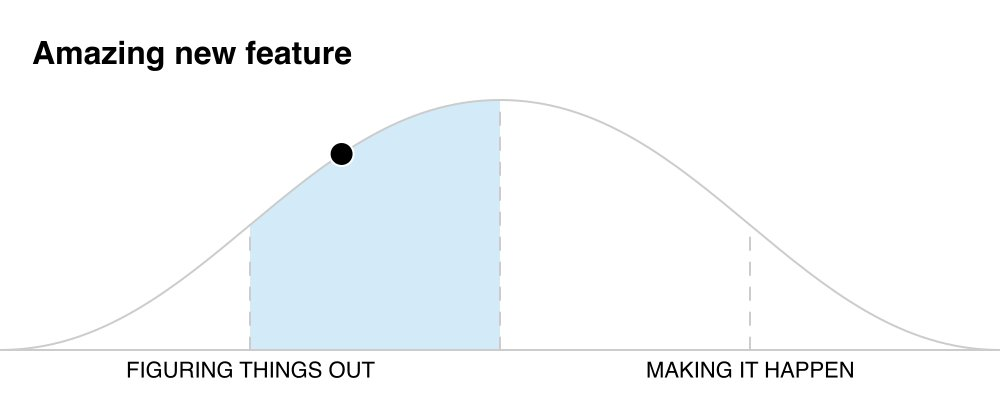
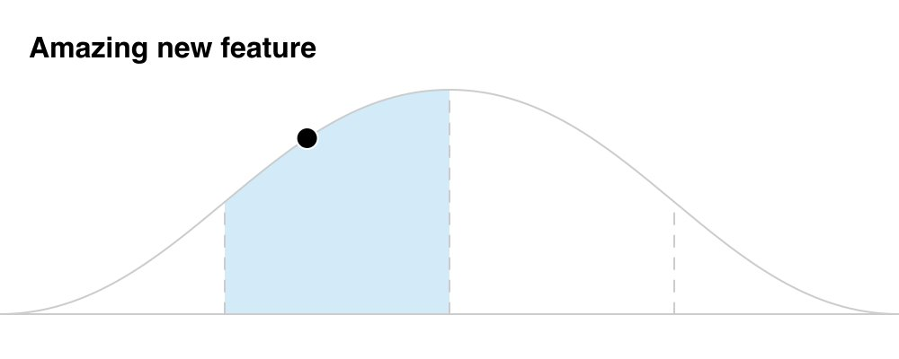

# Hill charts

## Development

```zsh
yarn dev
```

## Production

```zsh
yarn start
```

## Deployment

Automatically deploys to Railway.app when the `main` branch of the GitHub repo receives updates.

## Usage

### Direct URL

```js
/**
 * @typedef {Object} hillChartPublicOptions
 * @property {string} [title] - The title for the image
 * @property {boolean} [hideLabels=false] - Hide the labels
 * @property {any} [download=false] - Immediately download the image. Any value triggers it
 */
```

#### Set the percentage complete

Use the URL path to include the percentage complete (0 - 100).

```txt
# 0% -- Not started
http://localhost:3000/0

# 35%
http://localhost:3000/35

# 80%
http://localhost:3000/80

# 100% -- Done
http://localhost:3000/100
```

#### Add a Title

Use the `title` parameter to include a title within the image. The value provided will be added to the filename as well.

```txt
http://localhost:3000/35?title=Amazing+new+feature
```



#### Hide the labels

Use the `hideLabels` parameter to hide the chart labels.

```txt
http://localhost:3000/35?title=Amazing+new+feature&hideLabels=true
```



#### Download immediately

Add the `download` parameter with _any_ value to initiate a download.

```txt
http://localhost:3000/35?download=1
```
